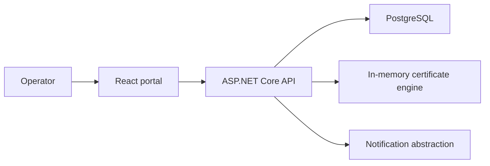

# Architecture

The domain and application layers have no UI or persistence dependency. Infrastructure owns EF Core, Identity, and SMTP. The API enforces role policies independently of the React UI. Production combines the static frontend and API in one container.

No component connects to Microsoft Graph, Entra ID, customer tenants, app registrations, or customer workloads. Tenant and client identifiers are inert operator-provided metadata.
