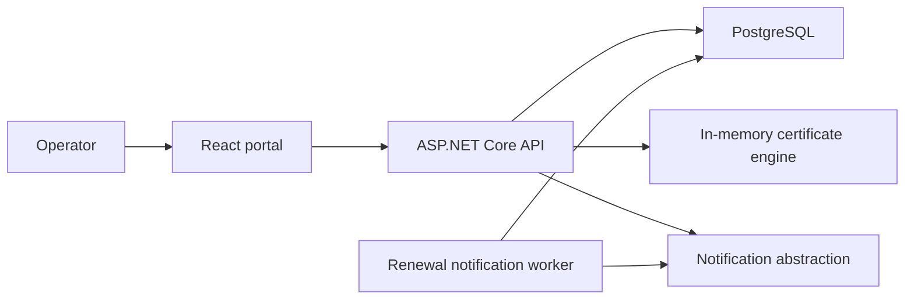

# Architecture

The domain and application layers have no UI or persistence dependency. Infrastructure owns EF Core, Identity, SMTP, and the hosted renewal worker. The API enforces role policies independently of the React UI. Production combines the static frontend, API, and worker in one container. The worker records successful milestone sends in `NotificationHistory` to prevent duplicate reminders.

No component connects to Microsoft Graph, Entra ID, customer tenants, app registrations, or customer workloads. Tenant and client identifiers are inert operator-provided metadata.

## Runtime flows

An authenticated mutation flows through forwarded-header processing, rate limiting, cookie authentication, antiforgery validation, role authorization, endpoint validation, application/infrastructure logic, and audit persistence. The React UI may hide actions by role, but the API policy is always the authorization boundary.

Certificate generation returns secret artifacts in a single response. The API persists the resulting metadata only; subsequent detail and inventory requests cannot retrieve the PFX or password.

At production startup, configuration is validated before serving traffic, EF migrations are applied, persisted SMTP/notification options are restored, and roles/bootstrap administration are seeded. The readiness endpoint reports unavailable until PostgreSQL can be reached.

## Deployment topology

Production runs the portal, API, and renewal worker in one non-root Linux container on App Service. Static React assets are built in the Docker frontend stage and copied into the published API image. PostgreSQL is reached through App Service VNet integration and private DNS. Key Vault references and managed identity keep the database connection out of ordinary application settings and deployment logs.

See [codebase reference](codebase.md), [infrastructure reference](infrastructure.md), and [pipeline reference](pipelines.md) for implementation and operating details.
