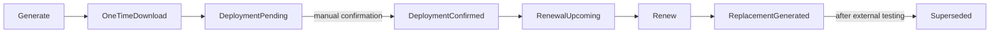

# Certificate lifecycle

Certificates use RSA (2048, 3072, or 4096 bits), a configurable SHA-2 signature, Digital Signature key usage, and Client Authentication EKU. Renewal links old and replacement metadata without prematurely superseding the old certificate. Health is derived from UTC expiry rather than persisted.
