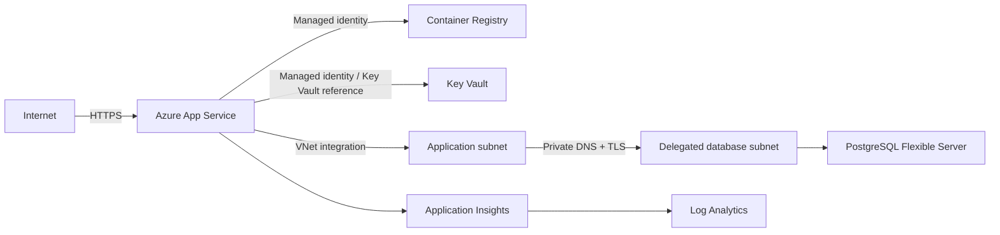

# Infrastructure reference

## Resource topology

Production PostgreSQL has public access disabled. The private DNS zone resolves its server name inside the VNet, while the connection string retains `SSL Mode=VerifyFull` so encryption and hostname verification remain enforced.

## Bicep parameters

| Parameter | Required | Notes |
| --- | --- | --- |
| `environmentName` | Yes | `dev`, `test`, or `prod`; controls sizing and database exposure |
| `location` | Defaults to resource group | Keep dependent resources in a supported common region |
| `postgresAdminLogin` | Yes | Bootstrap login, not an application-facing display value |
| `postgresAdminPassword` | Yes, secure | Never place in a parameter file committed to source |
| `seedAdminPassword` | Yes, secure | Required and validated at production startup |
| `imageTag` | Defaults to `latest` | Pipeline supplies the Git SHA; do not use `latest` for production releases |
| `prefix` | Defaults to `certmanager` | Combined with environment and deterministic suffix |

## Environment differences

| Capability | Dev/test | Production |
| --- | --- | --- |
| App Service plan | B1 | P1v3, always on |
| PostgreSQL SKU | Burstable B1ms | General Purpose D2ds v5 |
| Database backup retention | 7 days | 14 days |
| PostgreSQL endpoint | Public with Azure-services bootstrap rule | Private delegated subnet only |
| Application database path | App Service VNet integration | App Service VNet integration |

High availability and geo-redundant backup remain explicitly disabled in the current template. Enable them only after confirming regional support, recovery objectives, and cost. Production owners must compensate with tested PostgreSQL point-in-time restoration until then.

## Secret and identity flow

The Bicep deployment receives bootstrap passwords as secure parameters. It builds a TLS-verifying database connection string and stores it in Key Vault. App Service receives a Key Vault reference rather than the plaintext connection string in the template output.

The App Service system-assigned identity receives:

- `AcrPull` at the registry scope
- `Key Vault Secrets User` at the vault scope

ACR admin credentials remain disabled. Key Vault uses RBAC, soft delete, and a 90-day retention window.

## Persistent state

PostgreSQL contains application metadata, Identity data, audit entries, settings, and notification history. It never contains generated private keys or PFX passwords.

App Service persistent storage contains Data Protection keys under `/home/data-protection-keys`. Losing these keys invalidates existing cookies and can make portal-encrypted SMTP passwords unreadable. Back up and restrict this path as sensitive state.

## DNS and network changes

The PostgreSQL network mode is selected at server creation. Moving an existing public server to this topology requires a replacement private server and data migration. Validate DNS resolution and TLS from App Service before switching the Key Vault connection secret.

Custom domains require adding the hostname to `AllowedHosts` and configuring the App Service certificate/domain binding. Do not return to `AllowedHosts=*` as a shortcut.

## Recovery objectives

Before production approval, record organization-specific RPO and RTO values, then verify that backup retention, restoration time, alerting, and staffing meet them. Run a restore drill after material schema or networking changes.

